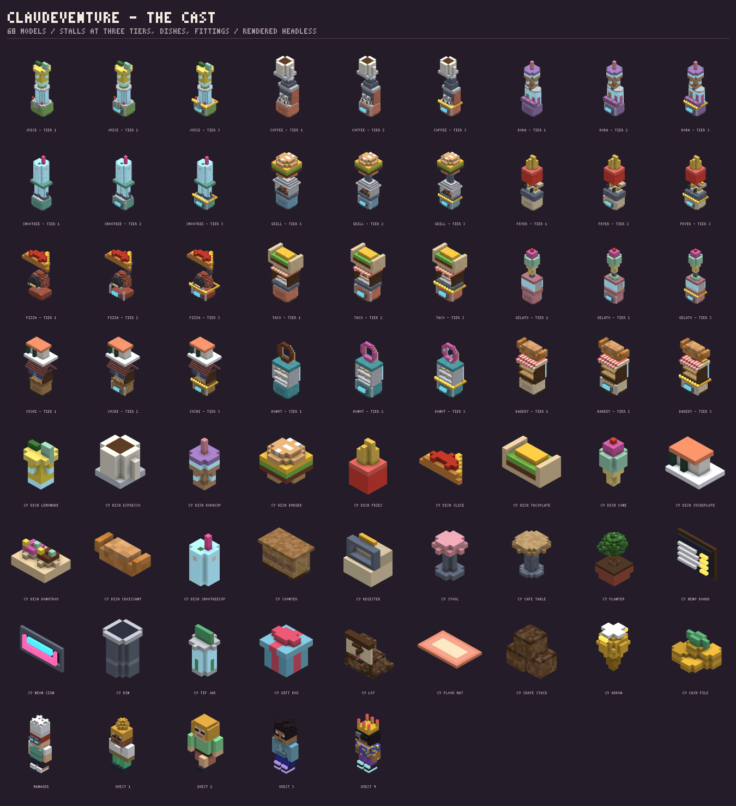
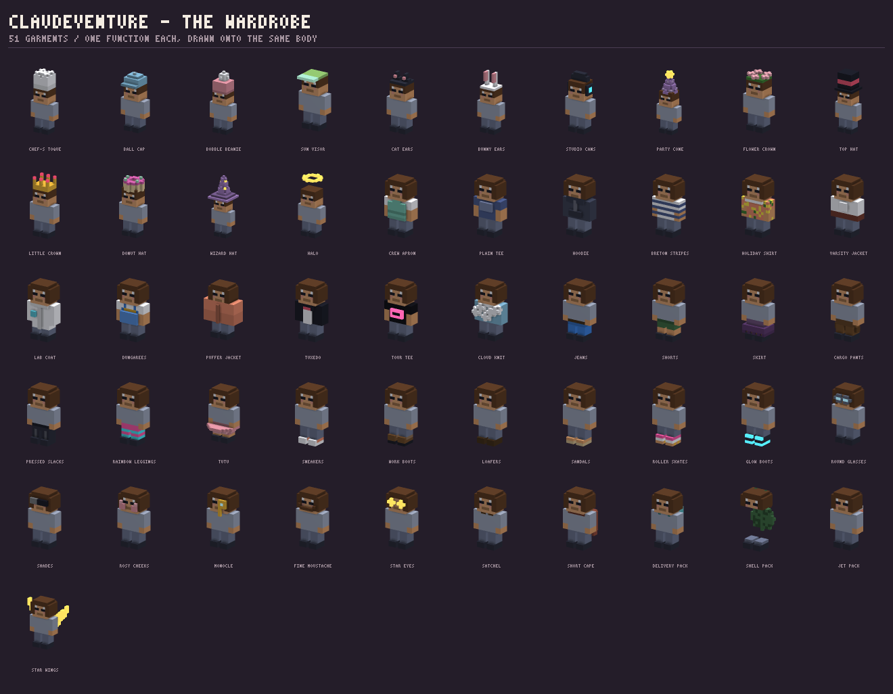

# ClaudeVenture

A cute isometric shop-builder that runs in a browser tab. You start with a
lemonade stand on a corner and end up running five of them; guests come in, the
crew run orders out, and everything you make goes straight back into the
machines.

**Live:** <https://isaiahaltdelete.github.io/Claude/claudeventure/>

Nothing in this folder is a sprite, a texture or a model file. Every object in
the game — the twelve stalls at three tiers each, the twelve dishes, the
fittings, the guests, the fifty-one things you can wear — is generated at load
time by the voxel maker in [`/voxel`](../voxel/README.md), from about two
thousand lines of readable JavaScript.



## The game

| | |
|---|---|
| **Machines** | Make food on a timer, into a tray that holds a few. Every level makes the dish worth 16% more and the machine 5% quicker. |
| **Crew** | Carry dishes from a machine to whoever is waiting. They are the real bottleneck, and hiring another is usually the best thing you can buy. |
| **Guests** | Arrive, wait, eat, pay, and leave the money on the floor. They give up if they wait too long. |
| **Money** | The till sweeps it up on its own; sweeping it by hand pays a fifth more. |
| **Boxes** | About one guest in sixteen leaves a gift box. Gems, and something to wear. |
| **Shops** | Five of them, each 250× richer than the last. Moving on resets the machines to level one and keeps everything else forever. |

Tap a machine to rush it for four seconds. Tap money to sweep it. Tap a box to
open it. `1`–`4` switch tabs.

The save lives in this browser under `isaiart.claudeventure` and nowhere else.
A shut shop keeps earning at 40% for up to eight hours.

## Fifty-one things to wear, and why they matter



A garment is a function handed the body's anchors and a colour:

```js
wear('hat', 'chef-toque', 'Chef’s Toque', 'common', ['tips', 0.04], (m, c) => {
  m.box(-3, 19, -3, 3, 20, 2, shade(c, 0.9));
  m.box(-3, 21, -3, 3, 23, 2, c);
  for (const [x, z] of [[-2, -2], [2, -2], [0, 0], [-2, 1], [2, 1]]) m.sphere(x, 24, z, 1.6, c);
}, P.white);
```

That is the entire definition: slot, id, name, rarity, what it does, how it is
built, and what colour it defaults to. Because it is drawn onto a body rather
than baked with one, the same fourteen hats fit every guest in the game in every
pose, and a garment that covers a region clears that region to skin first — so
short sleeves leave a forearm and shorts leave a shin, without any item saying
so.

Every garment carries a boost between 2% and 12%: takings, dish value, crew
speed, prep speed, guest patience, or box luck. A full outfit is worth about
+40%, which is enough to be worth chasing and not enough to be the game.

## Isometric, from a turntable

The maker in `/voxel` renders one model, framed by its own bounds, on a
turntable. A game needs the opposite: thirty models at once, each somewhere
different, all under one camera that does not move when they do.

`scripts/03-stage.js` is a second renderer over the same meshes. `VOX.mesh`
still does the greedy merge and bakes the ambient occlusion; `VOX.View` still
owns the camera maths and the light rig, and the shading in the vertex shader is
the same arithmetic in the same order as `voxel/scripts/08-webgl.js`. What is
added is per-draw placement — a translation, a turn about Y and a scale, applied
in the shader — so a mesh is uploaded once and drawn anywhere, any number of
times, at no cost per instance beyond a draw call.

The camera is orthographic at a fixed 45° yaw and 36° pitch. That is what makes
an isometric picture isometric: no perspective divide, so a stall at the back of
the shop is exactly the size of the same stall at the front, and the floor
stays a grid.

**Where WebGL2 is missing** the game does not degrade, it switches technique.
Each mesh is rendered *once* by the software rasteriser in
`voxel/scripts/05-raster.js` — the same code that bakes the sheets in
`voxel/assets` — at the scene's own angle and scale, and a frame becomes a
depth-sorted stack of `drawImage` calls. That is how isometric games were drawn
before anyone had a GPU, it runs at full frame rate on anything, and the only
thing it gives up is that a painter's algorithm occasionally puts a counter in
front of a stall it should be behind.

## The layout

```
index.html                 the page: house chrome outside the frame, game inside it
styles/01-tokens.css       page tokens, and the deliberate second visual language
styles/02-page.css         bar, masthead, colophon — house style
styles/03-game.css         the HUD

scripts/01-props.js        62 models: stalls at three tiers, dishes, fittings, the room
scripts/02-people.js       the body, its poses, and 51 garments
scripts/03-stage.js        the isometric renderer, WebGL2 and CPU
scripts/04-content.js      shops, curves, upgrades, drop tables — every tunable number
scripts/05-game.js         the simulation: fixed 20 Hz, knows nothing about pixels
scripts/06-scene.js        game state -> a list of things to draw
scripts/07-hud.js          the interface
scripts/08-boot.js         wiring, saving, and the loop

assets/cast-sheet.png      baked by tools/claudeventure-check.mjs
assets/wardrobe-sheet.png  likewise
assets/cast.json           a fingerprint per model, so CI catches a drifted recipe
```

Three things in there are less obvious than they look.

**The economy is priced by slot, not by machine.** Every shop has four pitches,
and every shop's four pitches cost the same relative amounts multiplied by that
shop's `scale`. The first version typed an absolute price onto each machine and
fell apart the moment two shops wanted the same one: a gelato cart priced for
the second shop was free in the fourth, and the run stalled around it.

**Offline earnings are measured, not modelled.** Every attempt to work out what
a shop makes from its prep times and dish values overestimated it several-fold,
because the bottleneck is nearly always a crew member's legs rather than a
machine's timer. The game keeps a rolling average of what it actually took, and
away time pays 40% of that.

**A walk is two poses and a bob.** Characters are built in the handful of poses
they can hold and flipped between two of them on a phase that advances with
distance travelled rather than with time — so crew in better shoes take quicker
steps rather than gliding faster.

## Headless, and therefore tested

```
node tools/claudeventure-check.mjs           # build and assert every model, bake the sheets
node tools/claudeventure-check.mjs --check   # fail if a recipe drifted
node tools/claudeventure-check.mjs --quiet   # assert only
node tools/smoke.mjs                         # play it in a real browser, twice
```

The check builds all 119 models with no browser anywhere, asserts the
catalogue's conventions over them (on the floor, centred on x, inside the
palette ceiling, deterministic), verifies that every station has a machine and a
dish and every garment a slot, a rarity and a boost the simulation can apply,
walks the shop scales to prove no later shop is cheaper than an earlier one, and
then runs two minutes of the actual simulation and fails if nobody was served.
`cast.json` carries an FNV-1a fingerprint per model, so a recipe that changes by
one voxel fails CI with its own name and the old and new hashes.

The smoke test plays the game in Chromium — reads pixels back off the canvas,
buys every stall with the real buttons, opens a box, checks every wardrobe tile
rendered its icon, taps the floor, waits for the money to arrive, and reloads
the save into a second profile. Then it does the whole thing again with WebGL
taken away.

## Why it does not look like the rest of the site

Everything on this site that is not a device simulator shares one theme: warm
neutral grounds, one phosphor accent, square corners, hairlines, monospaced
readouts. It is instrument panel taken as an interface language, and it is
right for a tool.

It is wrong for a toy. A game about running a lemonade stand needs fat rounded
corners, saturated candy colour, chunky buttons with a lip you can feel, and a
display face with some weight to it. So the split is explicit and lives on one
boundary: everything outside `.cv-frame` — the bar, the masthead, the colophon —
is house style and spends house tokens, and everything inside it spends the
`--cv-*` tokens, which are the voxel palette's own colours lifted straight out
of the generators. The interface and the models in the canvas are literally the
same colours.

Nothing is uploaded, there is no account, and there is nothing to install.
