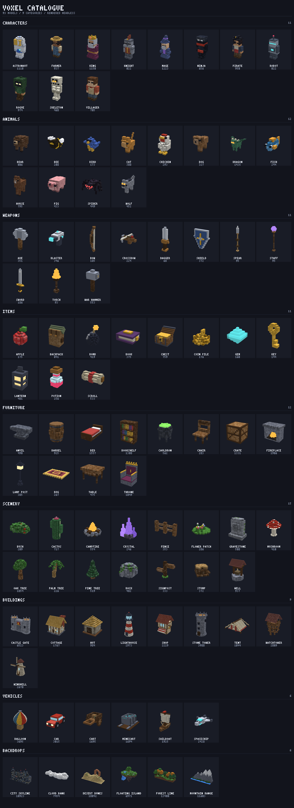
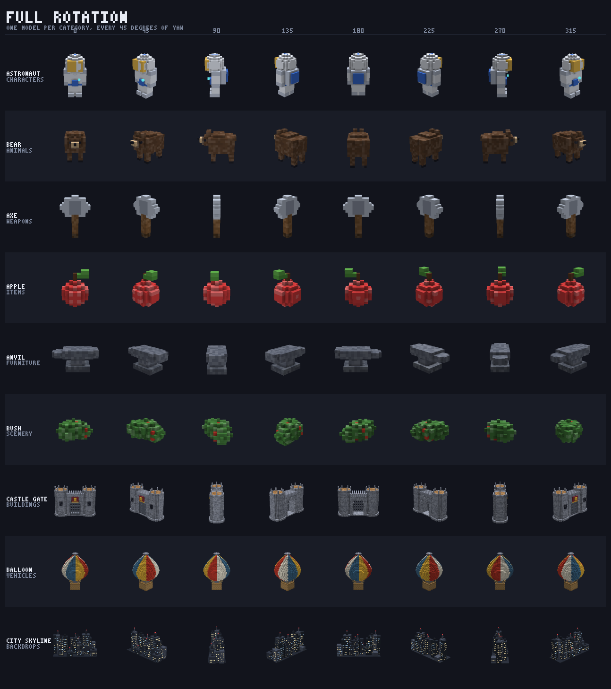

# Voxel Maker

A headless voxel model maker for browser games. Ninety-odd models — characters,
animals, weapons, items, furniture, scenery, buildings, vehicles and backdrops —
every one of them generated from code rather than placed by hand.

**Live:** <https://isaiahaltdelete.github.io/Claude/voxel/>

No dependencies, no build step, no network. The same files run in a game page,
in a Node script and in a test.



## Headless in the useful sense

A model here is a *recipe* — a function handed an empty grid:

```js
VOX.define({
  name: 'watchtower', category: 'buildings',
  build(m, kit) {
    for (const [x, z] of [[-7, -7], [7, -7], [-7, 7], [7, 7]]) m.box(x, 0, z, x + 1, 18, z + 1, kit.P.wood);
    m.box(-9, 19, -9, 9, 20, 9, kit.P.wood);
    m.gable(-10, 10, -10, 10, 27, '#7a4c46', 0, 1);
  },
});
```

Nothing in that needs a screen, so the catalogue can be built, meshed, exported,
rendered and diffed with no browser anywhere. That is what makes the images in
`assets/` worth anything: they are produced by the same code the page runs, on
the CPU, in about four seconds.

It also makes the catalogue cheap. Ninety-three models are ~150,000 voxels and
would be a few megabytes as mesh files; as recipes they are about 100 kB of
readable JavaScript, and a model costs a few milliseconds to build at load time.

## Using it in a game

```html
<script src="dist/voxel.js"></script>
<script>
  const knight = VOX.build('knight');        // any name in the catalogue
  VOX.Viewer.attach(canvas, knight);         // drag to turn, wheel to zoom

  const mesh = VOX.mesh(knight);             // greedy-meshed triangles, with baked AO
  VOX.Export.toVOX(knight);                  // MagicaVoxel bytes
  VOX.Export.toOBJ(knight);                  // { obj, mtl }
</script>
```

`dist/voxel.js` is the whole library as one file, generated from `scripts/` by
`node tools/voxel-build.mjs`. Loading the individual scripts in filename order
works identically — that is what the gallery does.

In Node:

```js
const VOX = require('./voxel/dist/voxel.js');
require('fs').writeFileSync('dragon.vox', VOX.Export.toVOX(VOX.build('dragon')));
```

## Conventions

Every model in the catalogue holds to these, and a build that breaks one fails
`tools/voxel-check.mjs`:

| | |
|---|---|
| Axes | Y up, X right, Z towards the camera. Everything with a front faces +Z. |
| Origin | Feet on `y = 0`, centred on x and z. Vehicles sit on their contact point. |
| Symmetry | Build the `x >= 0` half, call `mirrorX()`. Deliberate asymmetry comes after. |
| Scale | A character is 19 voxels to the top of the head; a one-handed weapon is ~14 long; a doorway is 7 clear. |
| Colour | From `VOX.palette`, never a literal, so nine files read as one world. |
| Palette size | At most 255 colours, which is what a `.vox` palette holds. |

## The library

```
scripts/01-core.js      the model: storage, primitives, mirroring, grain, JSON
scripts/02-palette.js   the shared palette and its ramps
scripts/03-mesh.js      face culling, greedy merging, baked ambient occlusion
scripts/04-view.js      camera and light rig — shared by both renderers
scripts/05-raster.js    software rasteriser (no GPU, no canvas, no browser)
scripts/06-catalog.js   the registry, and the kit every recipe is cut from
scripts/07-export.js    JSON, OBJ+MTL, PLY, MagicaVoxel .vox, and a PNG encoder
scripts/08-webgl.js     WebGL2 renderer — one context for the whole page
scripts/09-viewer.js    the turntable: drag, pinch, keyboard, idle spin
scripts/10-…-18-….js    the catalogue, one file per category
scripts/99-gallery.js   the gallery page (the only file that touches the DOM)
```

Three things in there are less obvious than they look:

**Greedy meshing.** A voxel only emits a face where its neighbour is missing,
and coplanar faces sharing a colour, a material and all four occlusion corners
merge into the largest rectangle available. A solid 4×4×4 cube is six quads, not
ninety-six. The castle gate is 6,523 voxels and 1,700 triangles.

**One light rig, two renderers.** `04-view.js` owns the camera and the lighting;
`05-raster.js` implements it in JavaScript and `08-webgl.js` implements it again
in GLSL. They have to agree, because the gallery uses one and the baked sheets
use the other — and the fallback path uses the first when WebGL2 is missing.

**One WebGL context.** Browsers cap contexts around sixteen and silently drop the
oldest, so eighty tiles cannot each have one. Everything renders into a single
offscreen canvas and each tile blits the result.

## Tools

```
node tools/voxel-check.mjs          1,400 assertions over every model
node tools/voxel-render.mjs         bake assets/*.png and assets/catalog.json
node tools/voxel-render.mjs --only knight    render one model to assets/preview.png
node tools/voxel-render.mjs --check          fail if the catalogue drifted
node tools/voxel-build.mjs          regenerate dist/voxel.js
node tools/voxel-build.mjs --check           fail if the bundle is stale
```

`catalog.json` carries a fingerprint per model — an FNV-1a hash of its sorted
voxels — so a recipe that changes by one voxel fails CI with the name of the
model and the old and new hashes. Recipes are deterministic by construction:
texture comes from a position hash, never from `Math.random`.

## The gallery

Tiles are built as they scroll into view, a couple per frame, so ninety-odd
models never block the main thread. Anything scrolled away is parked and costs
nothing. Drag a tile to turn it, or open one to get the big view, the palette,
the exports, and the source of the recipe that built it — editable, with
⌘/Ctrl+Enter to rebuild. That runs in your browser, against your own text;
nothing is sent anywhere and nothing is stored.

Reduced-motion preferences turn off the idle spin. Dragging still works, because
turning a model by hand is the point.


